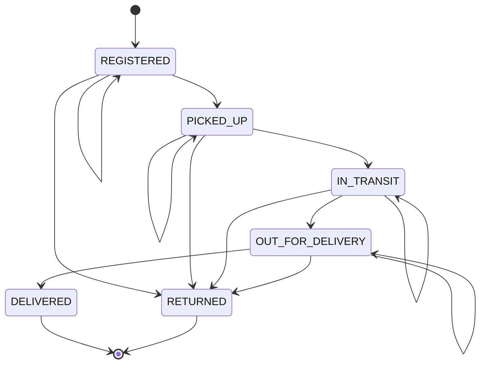

# Status Flow

This document details the state machine governing a package's status through the system. 
It strictly enforces Business Rule R6.

## Rule R6 Definition
The ordered status values are:
`REGISTERED` → `PICKED_UP` → `IN_TRANSIT` → `OUT_FOR_DELIVERY` → `DELIVERED`

Alternate branch: Any non-terminal status → `RETURNED`

- A status may repeat.
- A normal transition may advance exactly one sequence step.
- `IN_TRANSIT` may repeat at different hubs.
- `RETURNED` is reachable from any non-terminal status.
- `DELIVERED` and `RETURNED` are terminal.
- No `TRACKING_EVENT` may follow a terminal status.
- `PACKAGE.current_status` is a trigger-maintained cache.
- UI controls are only usability assistance; the database trigger remains authoritative.

## State Machine Diagram

## Transition Examples

### Valid Examples
- `REGISTERED` → `REGISTERED`
- `REGISTERED` → `PICKED_UP`
- `IN_TRANSIT` → `IN_TRANSIT`
- `OUT_FOR_DELIVERY` → `DELIVERED`
- `PICKED_UP` → `RETURNED`

### Invalid Examples
- `REGISTERED` → `IN_TRANSIT` (Skipped transition)
- `OUT_FOR_DELIVERY` → `PICKED_UP` (Backward transition)
- `DELIVERED` → any status (Event after DELIVERED)
- `RETURNED` → any status (Event after RETURNED)

## Implications & Design Decisions
- `TRACKING_EVENT` is the authoritative record of all status changes.
- The `current_status` column in the `PACKAGE` relation is strictly a trigger-maintained cache derived from `TRACKING_EVENT` to optimize reads. It must never be updated independently of creating a new `TRACKING_EVENT`.
- Tracking history is append-only (R7). We cannot alter or delete past events, guaranteeing an immutable audit trail.

## Relationship to DELIVERY_ATTEMPT
- `DELIVERY_ATTEMPT` records an attempt outcome independently.
- Creating a `DELIVERY_ATTEMPT` does not automatically insert a `TRACKING_EVENT`.
- Creating a `DELIVERY_ATTEMPT` does not automatically update `PACKAGE.current_status`.
- A failed attempt must have a failure reason.
- A successful attempt must not have a failure reason.
- Any package status change must be recorded separately through F3 as a `TRACKING_EVENT` and validated by R6.
- A failed attempt may be followed by another OUT_FOR_DELIVERY event or by RETURNED, depending on a later explicit operational decision.
- A successful attempt should be followed by an explicit DELIVERED tracking event; do not claim that this transaction is already implemented in Phase 0.